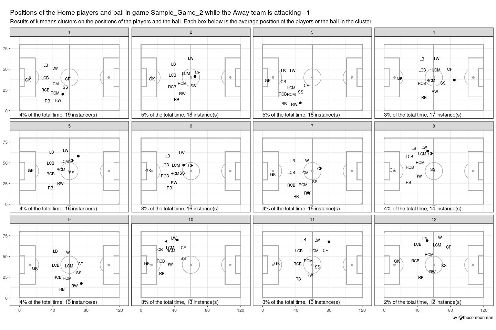
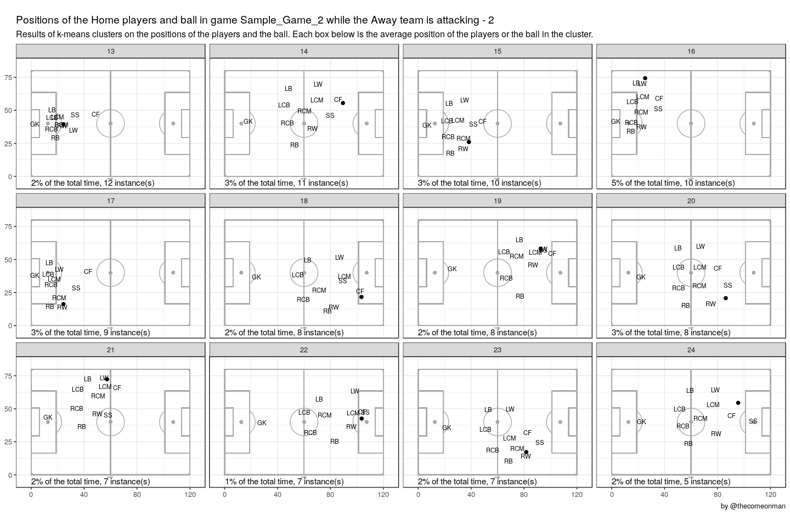
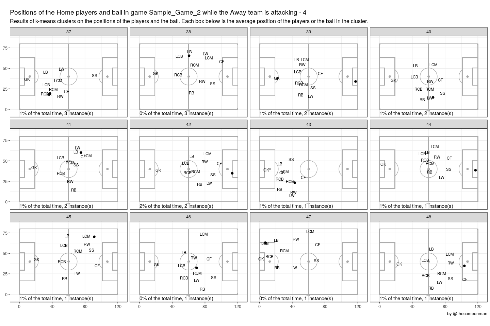

Before you begin:
-----------------

Before attempting to run this code, follow the instructions at
<a href="https://github.com/thecomeonman/CodaBonito" class="uri">https://github.com/thecomeonman/CodaBonito</a>
to install some dependencies.

Also get the tracking data, recently made public as part of the Friends
of Tracking sessions by Metrica from here -
<a href="https://github.com/metrica-sports/sample-data" class="uri">https://github.com/metrica-sports/sample-data</a>

Some things that you can quickly see
------------------------------------

-   They seem to either play in a 4-4-1-1 / 4-4-2, see clusters 4, 5, 7,
    8

-   Or they switch to a back three sometimes with the two CBs and either
    the LB or the RCM, see clusters 1, 2, 3

-   The LCM is more involved further up the field than the RCM, see
    clusters 2, 3, 9

-   The RB has more of an attacking role than the LB, see clusters 1, 6,
    9

-   Attacks go through the right more often than the left

-   The LB has a more defensive role

-   The RW has a more central role, either as an RWF or a CM, see
    clusters 1, 2, 3

-   The SS, RW, and RB have a lot of combinations, see clusters 6, 9

-   The LW, and the RB as well, try to provide width, see clusters 1, 3,
    6a

-   Clusters 16, 30 might be corners

Disclaimer
----------

I usually don’t post things so early in the process but making an
exception because I’m surprised: 1. at how informative this already is
2. that I haven’t seen this on Twitter yet. A quick Google Scholar
search didn’t give anything strong either

Will look around some more.
