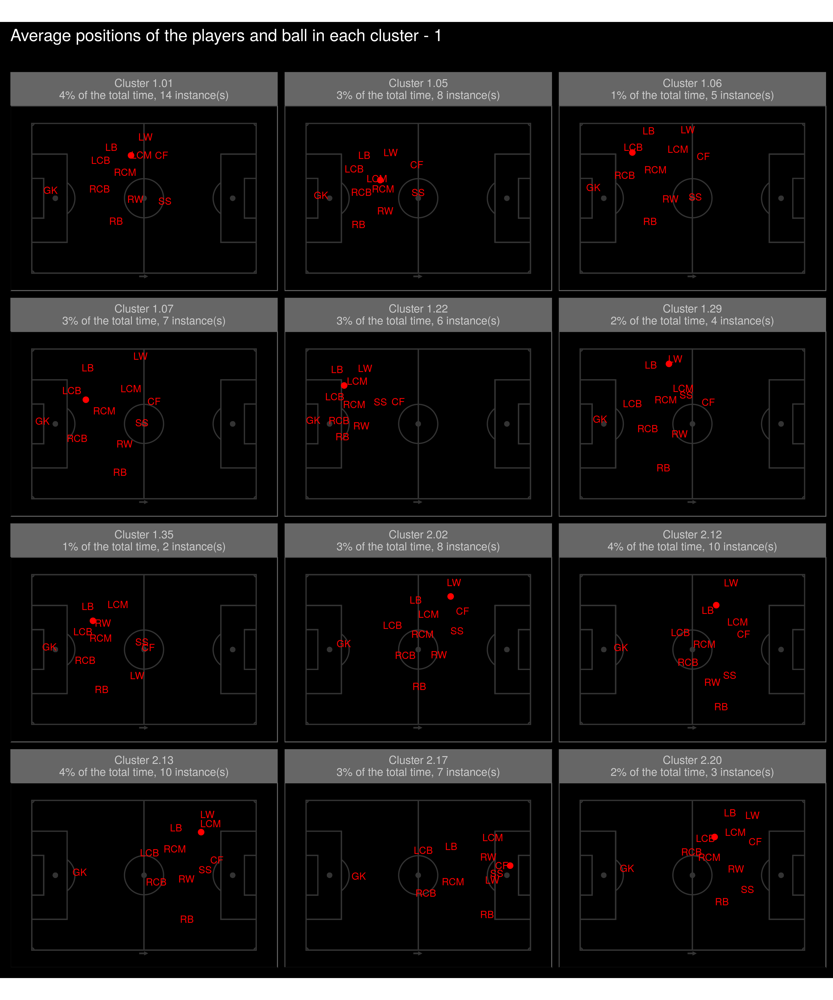
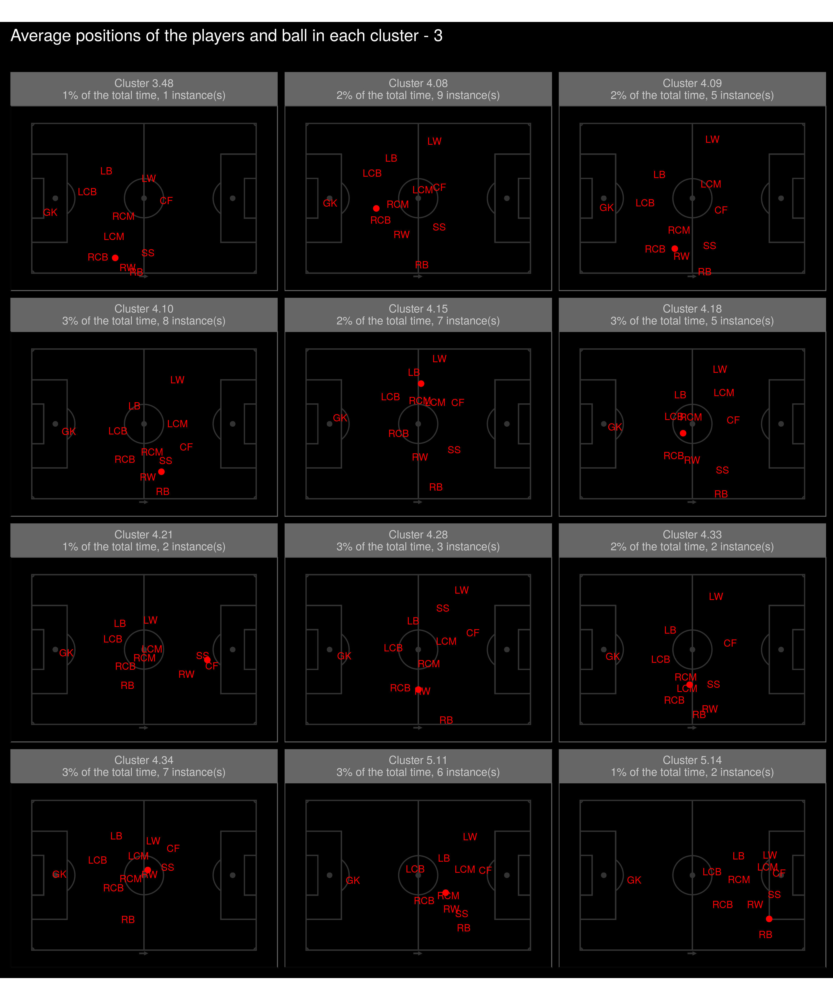

This is a very very very WIP post.

Data Handling
-------------

-   I take one in every three frames just to lower the number of frmaes
    that need to be managed. This means there are aabout 8 frames per
    second which is still sufficient resolution for us to run this
    analysis.

-   Players substituted for each other are treated as the same player
    for purpose of clustering, analysis, etc.

Procedure
---------

-   This post focuses on the home team attacking during sample game 2.

-   Euclidean distance calculated between the players or the ball in
    each frame and passed to a hierarchical clustering algorithm.

-   I extract two levels of clusters from this, a set of 6 clusters and
    set of 48 clusters. I call the first set of clusters, cluster
    groups, and the second set of clusters just clusters. No strong
    reason behind why six clusters except it’s a good balance between
    splitting the data into an unmanageably large number of clusters and
    not splitting it enough and being unable to infer anything out of
    them. No strong reason behind 48 either except it’s an easy number
    to work with.

Understanding cluster groups
----------------------------

The six clusters broadly capture situations which are in place when the
ball is in various parts of the field. Clusters 1 and 3 capture the two
sides in the defensive half. Clusters 2 and 5 capture the two sides in
the offensive half. Cluster 4 is when the ball is in midfield. Cluster 6
is sort of inbetween clusters 4 and 5.

Understanding clusters
----------------------

Diving into the smaller clusters -

Some things that you can quickly see
------------------------------------

Note: This section hasn’t been updated for the new clusters so the
example clusters are probably wrong but the observations should still
hold

-   They seem to either play in a 4-4-1-1 / 4-4-2, see clusters 4, 5, 7,
    8

-   Or they switch to a back three sometimes with the two CBs and either
    the LB or the RCM, see clusters 1, 2, 3

-   The LCM is more involved further up the field than the RCM, see
    clusters 2, 3, 9

-   The RB has more of an attacking role than the LB, see clusters 1, 6,
    9

-   Attacks go through the right more often than the left

-   The LB has a more defensive role

-   The RW has a more central role, either as an RWF or a CM, see
    clusters 1, 2, 3

-   The SS, RW, and RB have a lot of combinations, see clusters 6, 9

-   The LW, and the RB as well, try to provide width, see clusters 1, 3,
    6a

-   Clusters 16, 30 might be corners

Exploring a cluster in more detail
----------------------------------

Cluster occurrence across the duration of the game
--------------------------------------------------

There are interesting patterns in terms of how clusters occur at various
points in the game. After pretty much each significant event, you can
notice a change in the patterns of clusters exhibited.

The flow between clusters
-------------------------

The team doesn’t randomly move between clusters, there are some
transitions that occur far more frequently than others.
