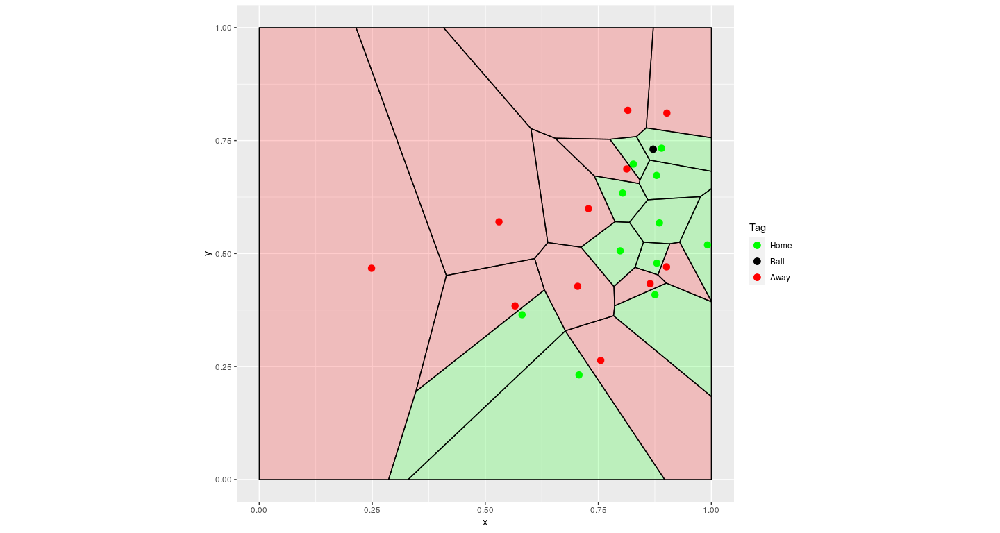

Before you begin:
-----------------

Before attempting to run this code , you will need to install the
CodaBonito library, run the lines below in your R console and that
should hopefully be it - `install.packages("devtools");`
`library(devtools);` `install_github("thecomeonman/CodaBonito");`

You will also need to install data.table and ggplot2, which can be
installed off of CRAN - `install.packages(c('data.table','ggplot2'))`

Also get the tracking data, recently made public as part of the Friends
of Tracking sessions by Metrica from here -
<a href="https://github.com/metrica-sports/sample-data" class="uri">https://github.com/metrica-sports/sample-data</a>

You’re good to go now

The code
--------

    library(CodaBonito)
    library(data.table)
    library(ggplot2)

    rm(list = ls())

    # Instructions
    # You would have downloaded and saved the data from Github at some location on
    # your system. In my case, it's /media/ask/Data/Personal/Projects/Personal/sample-data
    # Replace the location below with the respective location from your machine
    cDataRootFolder = '/media/ask/Data/Personal/Projects/Personal/sample-data/data/'
    cGameName = 'Sample_Game_1'
    nXLimit = 120
    nYLimit = 80

    # loading the data in
    dtData = fParseTrackingDataBothTeams(
       cRootPath = cDataRootFolder,
       cGameName = cGameName,
       nXLimit = nXLimit,
       nYLimit = nYLimit,
       xMaxBB = 1,
       yMaxBB = 1
    )

    # Instructions
    # getting a random slice
    # basically, a row from the tracking data
    # you can choose to pick your own slice
    dtTrackingSlice = dtData[ 
       Frame <= ( sample( Frame[which(Subtype == "ON TARGET-GOAL")], 1) + 25 )
       # Frame <= ( sample( Frame[which(HomePlayer8X > 125)], 1) + 25 )
       
    ][
       Frame >= max(Frame) - 100
    ][
       # Frame <= max(Frame) - 30
    ]

    # minimal tracking slice example if you don't want to run the whole file
    if ( F ) {

       dtTrackingSlice = data.table(
          # Period = 1,
          Frame = 4431,
          # Time_s = 177.24,
          # Team = 'Home',
          # Type = 'Pass',
          # Subtype = '',
          # EndFrame = 1,
          # EndTime_s = 1,
          # From = 'HomePlayer1X',
          # From = 'AwayPlayer1X',
          HomePlayer1X = nXLimit * runif(1),
          HomePlayer2X = nXLimit * runif(1),
          HomePlayer3X = nXLimit * runif(1),
          HomePlayer1Y = nYLimit * runif(1),
          HomePlayer2Y = nYLimit * runif(1),
          HomePlayer3Y = nYLimit * runif(1),
          AwayPlayer1X = nXLimit * runif(1),
          AwayPlayer2X = nXLimit * runif(1),
          AwayPlayer3X = nXLimit * runif(1),
          AwayPlayer1Y = nYLimit * runif(1),
          AwayPlayer2Y = nYLimit * runif(1),
          AwayPlayer3Y = nYLimit * runif(1),
          BallX = nXLimit * runif(1),
          BallY = nYLimit * runif(1)
       )

    }

    voronoiOutput = fDrawVoronoiFromTable(
       dtTrackingSlice[1],
       nXLimit = nXLimit,
       nYlimit = nYlimit,
       UseOneFrameEvery = 1
    )

    print(voronoiOutput)

    voronoiOutput = fDrawVoronoiFromTable(
       dtTrackingSlice,
       nXLimit = nXLimit,
       nYlimit = nYlimit,
       UseOneFrameEvery = 4
    )

    if ( !interactive() ) {
       
       file.copy(
          voronoiOutput,
          './README_files/figure-markdown_strict/Voronoi.gif'
       )
       
    }

I delibrately left that bit there where the player goes outside the
pitch. I don’t know what is the best strategy to depict that.
Suggestions welcome.

Next steps
----------

Making it prettier, adding pitch outlines, etc.
