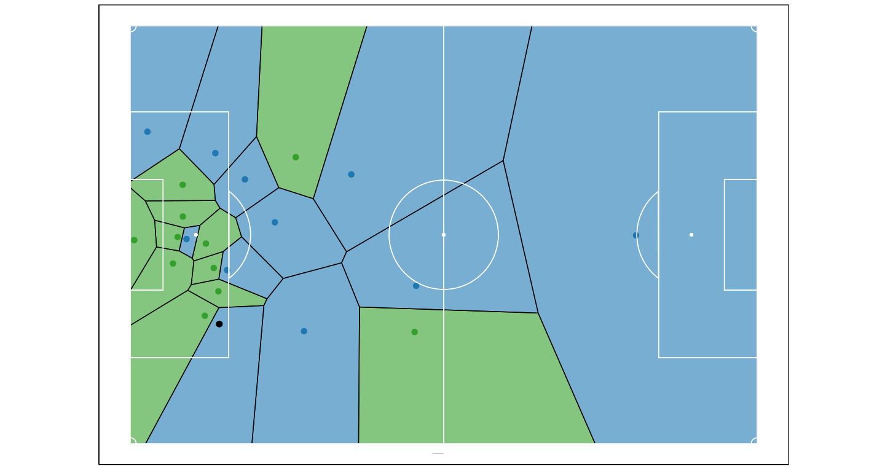

Before you begin:
-----------------

Before attempting to run this code , you will need to install the
CodaBonito library, run the lines below in your R console and that
should hopefully be it - `install.packages("devtools");`
`library(devtools);` `install_github("thecomeonman/CodaBonito");`

You will also need to install data.table and ggplot2, which can be
installed off of CRAN - `install.packages(c('data.table','ggplot2'))`

Also get the tracking data, recently made public as part of the Friends
of Tracking sessions by Metrica from here -
<a href="https://github.com/metrica-sports/sample-data" class="uri">https://github.com/metrica-sports/sample-data</a>

You’re good to go now

The code
--------

    library(CodaBonito)
    library(data.table)
    library(ggplot2)

    rm(list = ls())

    # Instructions
    # You would have downloaded and saved the data from Github at some location on
    # your system. In my case, it's /media/ask/Data/Personal/Projects/Personal/sample-data
    # Replace the location below with the respective location from your machine
    cDataRootFolder = '/media/ask/Data/Personal/Projects/Personal/sample-data/data/'
    cGameName = 'Sample_Game_1'
    nXLimit = 120
    nYLimit = 80

    # loading the data in
    lData = fParseTrackingDataBothTeams(
       cRootPath = cDataRootFolder,
       cGameName = cGameName,
       nXLimit = nXLimit,
       nYLimit = nYLimit,
       xMaxBB = 1,
       yMaxBB = 1
    )

    # Instructions
    # getting a random slice
    # basically, a row from the tracking data
    # you can choose to pick your own slice

    dtEventSlice = lData$dtEventsData[
       # Frame == ( sample( Frame[which(Subtype == "ON TARGET-GOAL")], 1) )
       StartFrame == 99032
    ]

    dtTrackingSlice = lData$dtTrackingData[ 
       # Frame <= ( sample( Frame[which(Subtype == "ON TARGET-GOAL")], 1) + 25 )
       Frame <= dtEventSlice[, StartFrame + 25]
    ][
       Frame >= max(Frame) - 125
    ][
       # Frame <= max(Frame) - 30
    ]

    dtEventSlice = lData$dtEventsData[
       StartFrame %in% dtTrackingSlice[, Frame] &
       EndFrame %in% dtTrackingSlice[, Frame]
    ]

    voronoiOutput = fDrawVoronoiFromTable(
       dtTrackingSlice[Frame == min(Frame)],
       nXLimit = nXLimit,
       nYLimit = nYLimit
    )

    print(voronoiOutput)

    voronoiOutput = fDrawVoronoiFromTable(
        dtTrackingSlice,
        nXLimit = nXLimit,
        nYLimit = nYLimit,
        UseOneFrameEvery = 1,
        DelayBetweenFrames = 5
    )

    if ( !interactive() ) {
        
        qwe = suppressWarnings(
            file.remove('./README_files/figure-markdown_strict/Voronoi.gif')
        )
        rm(qwe)

        qwe = file.copy(
            voronoiOutput,
            './README_files/figure-markdown_strict/Voronoi.gif'
        )

        rm(qwe)
        
    }

I delibrately left that bit there where the player goes outside the
pitch. I don’t know what is the best strategy to depict that.
Suggestions welcome.

What about adding some annotations?

    voronoiOutput = fDrawVoronoiFromTable(
        dtTrackingSlice,
        nXLimit = nXLimit,
        nYLimit = nYLimit,
        UseOneFrameEvery = 1,
        DelayBetweenFrames = 5,
        markTrajectoryFor = c(
            'HomePlayer5',
            'HomePlayer4',
            'AwayPlayer17'
        ),
        markOffsideLineFor = list(
            c('Away', 'AwayPlayer25', min)
        ),
        markLineBetween = list(
            c('HomePlayer4','AwayPlayer17')
        )
    )

    if ( !interactive() ) {
        
        qwe = suppressWarnings(
            file.remove('./README_files/figure-markdown_strict/Voronoi.gif')
        )
        rm(qwe)

        qwe = file.copy(
            voronoiOutput,
            './README_files/figure-markdown_strict/VoronoiAnnotated.gif'
        )

        rm(qwe)
    
    }

What’s the line that the defense is holding?

Could the player making the cross have gotten closed quicker to prevent
the cross from happening?

Note how the recipient of the cross is in an offside position but
recovers in time for the cross.

Next steps
----------

Making it prettier, adding pitch outlines, etc.
