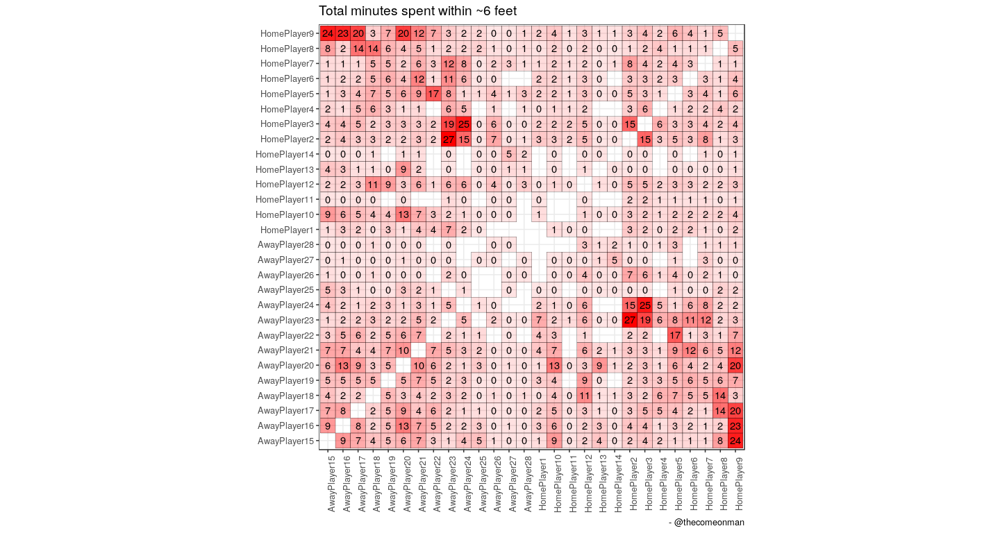
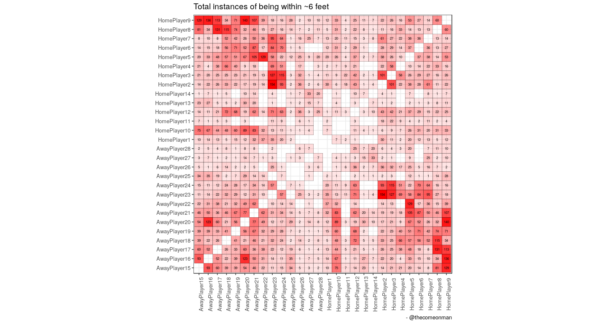
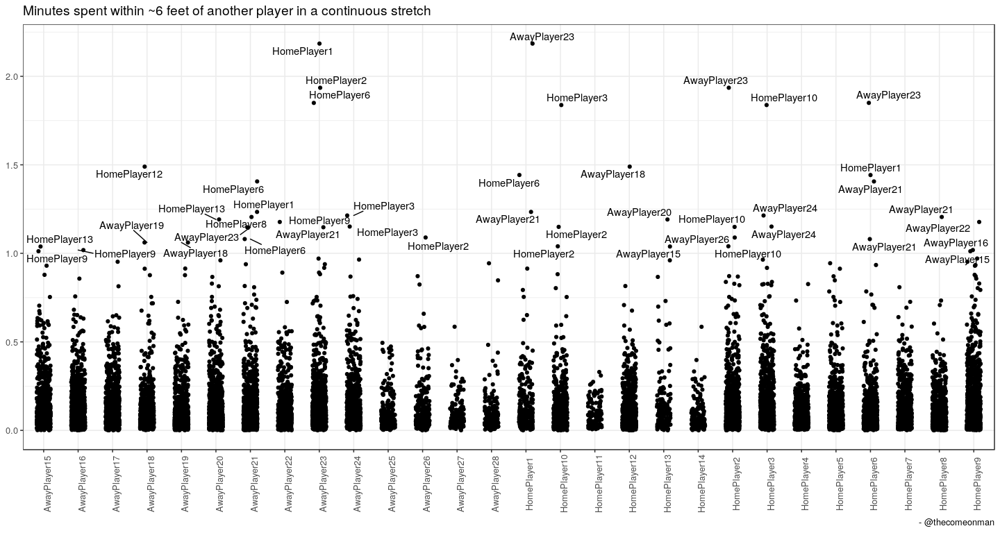
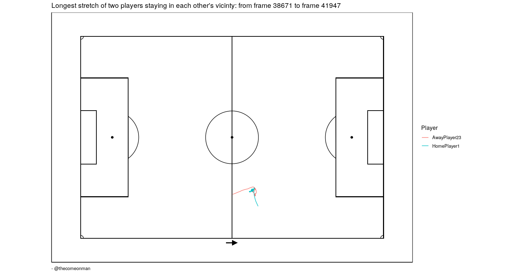

Before you begin:
-----------------

Before attempting to run this code, follow the instructions at
<a href="https://github.com/thecomeonman/CodaBonito" class="uri">https://github.com/thecomeonman/CodaBonito</a>
to install some dependencies.

Also get the tracking data, recently made public as part of the Friends
of Tracking sessions by Metrica from here -
<a href="https://github.com/metrica-sports/sample-data" class="uri">https://github.com/metrica-sports/sample-data</a>

The code
--------

